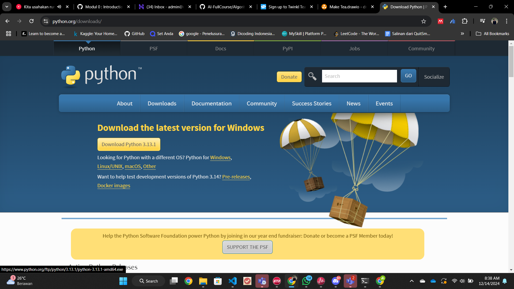
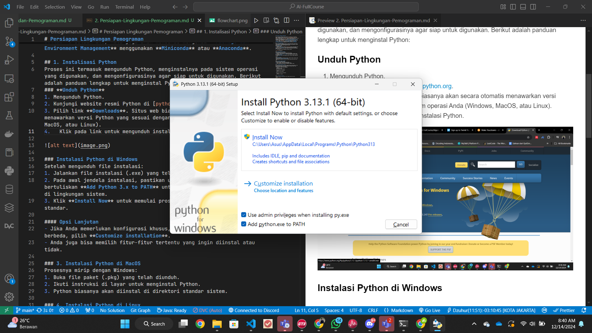
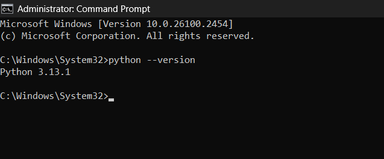
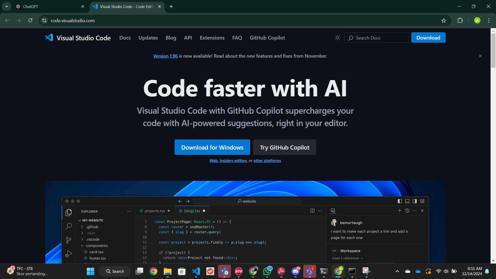
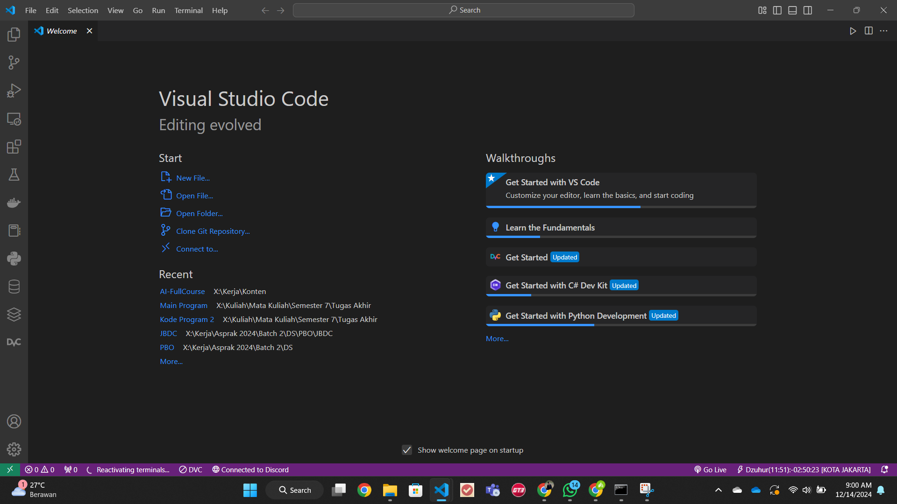
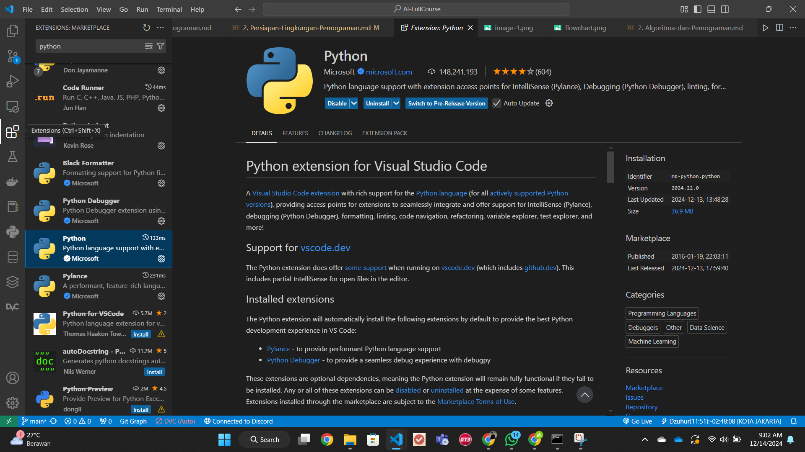
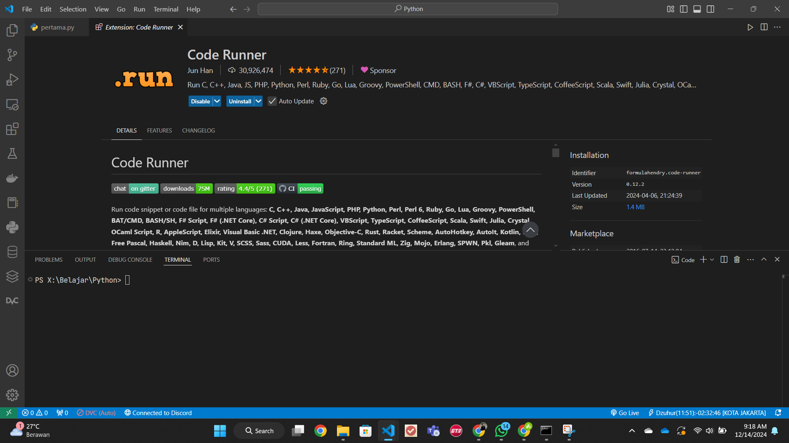
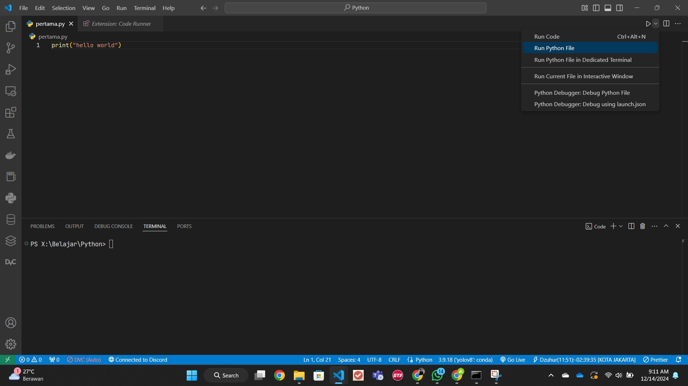
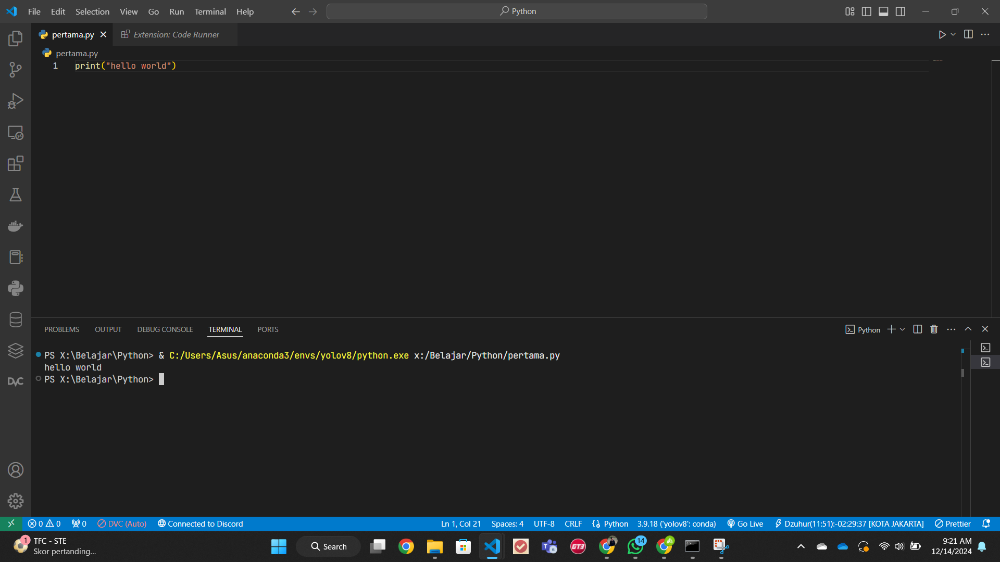

# Persiapan Lingkungan Pemograman


Dalam melakukan pemograman maka diperlukan lingkungan yang mendukung. Adapun lingkungan tersebut terdiri dari `bahasa pemograman` dan `text editor`. Definisi dari `text editor` sendiri adalah aplikasi software yang digunakan untuk mengedit teks. Ini adalah alat penting bagi para pengembang karena memungkinkan untuk **menulis dan mengedit kode sumber program**. Pada pembelajaran ini kita akan menggunakan bahasa pemograman `Python` dengan `Text Editor` **Visual Studio Code** atau **Google Collab**.

## 1. Instalisasi Python

Proses ini termasuk mengunduh Python, menginstalnya pada sistem operasi yang digunakan, dan mengonfigurasinya agar siap untuk digunakan. Berikut adalah panduan lengkap untuk menginstal Python:

### **Unduh Python**

1. Mengunduh Python.
2. Kunjungi website resmi Python di [python.org](./Assets/https://www.python.org/).
3. Pilih link **Downloads**. Situs web biasanya akan secara otomatis menawarkan versi Python yang sesuai dengan sistem operasi Anda (Windows, MacOS, atau Linux).
4. Klik pada link untuk mengunduh instalasi Python.



### Instalasi Python di Windows

Setelah mengunduh file instalasi:

1. Jalankan file instalasi (.exe) yang telah diunduh.
2. Pada awal jendela instalasi, pastikan untuk menandai checkbox yang bertuliskan **Add Python 3.x to PATH** untuk memastikan Python terdaftar di lingkungan sistem.
3. Klik **Install Now** untuk memulai proses instalasi dengan pengaturan standar.



### Verifikasi Instalasi

Setelah instalasi, buka terminal atau command prompt dan ketik:

```bash
python --version
```

atau

```bash
python3 --version
```



Ini akan menampilkan versi Python yang telah diinstal, memastikan bahwa Python sudah terpasang dengan benar.

## **2. Instalisasi VSCode**

Visual Studio Code (VSCode) adalah editor kode sumber yang sangat populer untuk pengembangan perangkat lunak. Editor ini mendukung berbagai bahasa pemrograman dan memiliki banyak fitur yang dapat diperluas melalui ekstensi. Berikut adalah panduan lengkap untuk menginstal Visual Studio Code:

### 1. Unduh Visual Studio Code

Pertama, Anda perlu mengunduh VSCode:

- Kunjungi website resmi Visual Studio Code di [https://code.visualstudio.com/](./Assets/https://code.visualstudio.com/).
- Klik pada tombol unduhan yang sesuai dengan sistem operasi Anda (Windows, MacOS, atau Linux).
- Unduh file instalasi yang sesuai.



### 2. Instalasi VSCode di Windows

Setelah mengunduh file instalasi:

1. Jalankan file `.exe` yang telah diunduh.

   .png>)

2. Ikuti petunjuk instalasi pada layar. Pilih lokasi instalasi jika perlu.
3. Pada salah satu layar, Anda akan memiliki opsi untuk menambahkan VSCode ke PATH dan membuat ikon pada desktop. Pilih sesuai kebutuhan Anda.

   .png>)

   .png>)

4. Lanjutkan dengan instalasi hingga selesai.

   .png>)

   

5. Untuk membuat lingkungan pengembangan yang lebih nyaman maka anda bisa melakukan install extenstion python seperti di bawah ini

   

6. Selain itu anda juga dapat melakukan install untuk extension bernama `code runner`

   

## 3. Google Collab

Untuk belajar Machine Learning tidak perlu device yang bagus karena saat ini telah tersedia platform Online seperti `Google Collab` yang dapat diakses melalui Google.

.png>)

.png>)

Setelah semua selesai, maka anda bisa membuat sebuah folder terlebih dahulu dengan `open folder` dan kemudian membuat sebuah file dengan nama `<nama_file>.py` dengan menekan tombol `new file di pojok kiri atas`.

.png>)

.png>)

-1.png>)

Lalu jalankan kode anda dengan menekan tombol di pojok kanan:




