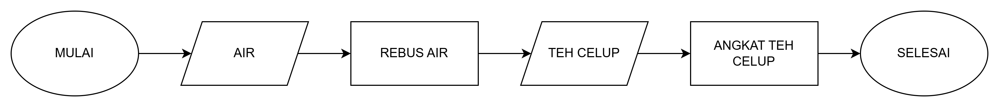

# Pengenalan Algoritma dan Pemograman? 🤔💻

## **1. Algoritma** 🧩

Algoritma adalah sekumpulan langkah-langkah atau instruksi yang terstruktur untuk menyelesaikan suatu masalah atau mencapai tujuan tertentu. Bayangkan algoritma sebagai resep masakan: ia menjelaskan langkah-langkah yang harus diikuti untuk menghasilkan hidangan akhir.



**Contoh Sederhana:** **Algoritma Membuat Teh**

1. Rebus air.
2. Masukkan teh celup ke dalam cangkir.
3. Tuangkan air mendidih ke cangkir.
4. Tunggu beberapa menit.
5. Angkat teh celup dan teh siap dinikmati!

## Ciri-Ciri Algoritma

1. **Terbatas:** Algoritma harus memiliki jumlah langkah yang terbatas. Langkah-langkahnya tidak boleh tak terhingga.
2. **Tidak Ambigu:** Setiap instruksi dalam algoritma harus jelas dan tidak menimbulkan berbagai interpretasi.
3. **Input:** Algoritma menerima input. Bisa jadi tidak ada atau bisa juga lebih dari satu.
4. **Output:** Algoritma menghasilkan output. Harus ada setidaknya satu output, tergantung pada tujuan algoritma tersebut.
5. **Efektivitas:** Setiap langkah harus cukup sederhana sehingga dapat diselesaikan dalam waktu yang wajar dan dengan jumlah sumber daya yang wajar.

## **2. Pemrograman** 🖥️

Pemrograman adalah proses menulis, mengedit, dan memelihara kode sumber yang ditulis dalam bahasa pemrograman. Tujuannya adalah untuk membuat aplikasi, program, atau sistem yang dapat menyelesaikan masalah atau melakukan tugas tertentu sesuai dengan algoritma yang telah ditentukan.

**Contoh Sederhana:**

- **Program Menampilkan "Hello, World!"**

  ```python
  print("Hello World")
  ```

  Program ini mengikuti algoritma sederhana untuk menampilkan pesan "Hello, World!" di layar.

**Bahasa Pemrograman:**

Bahasa pemrograman seperti Python, Java, dan JavaScript adalah alat yang digunakan untuk menulis kode yang mengikuti algoritma. Setiap bahasa memiliki sintaks dan fitur khas yang memudahkan pembuatan program.

## **3. Hubungan antara Algoritma dan Pemrograman**

- **Algoritma sebagai Dasar**: Algoritma adalah blueprint atau rencana untuk menyelesaikan suatu masalah. Sebelum menulis kode, kita perlu merancang algoritma untuk menentukan langkah-langkah yang harus diikuti.
- **Pemrograman sebagai Implementasi**: Pemrograman adalah proses menerjemahkan algoritma ke dalam kode yang bisa dijalankan oleh komputer. Dalam hal ini, bahasa pemrograman adalah medium yang digunakan untuk merealisasikan algoritma ke dalam aplikasi nyata.

- **Dari Konsep ke Kode**: Algoritma memberi kita pemahaman tentang apa yang harus dilakukan, sementara pemrograman memberi kita alat untuk melakukannya. Jadi, algoritma membantu kita merancang solusi, dan pemrograman membantu kita menerapkannya.
